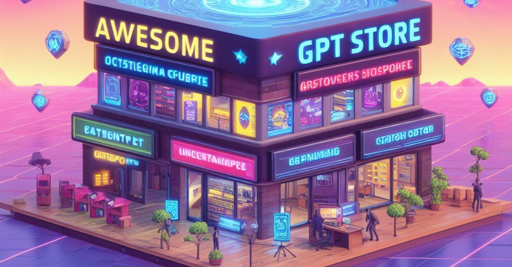

# awesome-gpt-store 🏠
This repo includes all customized GPTs on openai gpt store (approx 6K, up to 2023/11/14)
 <h4 align="left">
  
  
  
  
</h4>

## Table of Contents
- 🎬 [Entertainment](https://github.com/yulongwang12/awesome-gpt-store/tree/main/asset/Entertainment.md)
- 📱 [Technology](https://github.com/yulongwang12/awesome-gpt-store/tree/main/asset/Technology.md)
- 📚 [Education](https://github.com/yulongwang12/awesome-gpt-store/tree/main/asset/Education.md)
- 💼 [Business](https://github.com/yulongwang12/awesome-gpt-store/tree/main/asset/Business.md)
- 🎨 [Art & Design](https://github.com/yulongwang12/awesome-gpt-store/tree/main/asset/Art%20%26%20Design.md)
- 🌟 [Lifestyle](https://github.com/yulongwang12/awesome-gpt-store/tree/main/asset/Lifestyle.md)
- 🛠️ [Utilities](https://github.com/yulongwang12/awesome-gpt-store/tree/main/asset/Utilities.md)
- 🏋️‍♂️ [Health & Fitness](https://github.com/yulongwang12/awesome-gpt-store/tree/main/asset/Health%20%26%20Fitness.md)
- 🎮 [Gaming](https://github.com/yulongwang12/awesome-gpt-store/tree/main/asset/Gaming.md)
- 💰 [Finance](https://github.com/yulongwang12/awesome-gpt-store/tree/main/asset/Finance.md)
- 🤔 [Philosophy](https://github.com/yulongwang12/awesome-gpt-store/tree/main/asset/Philosophy.md)
- 🔬 [Science](https://github.com/yulongwang12/awesome-gpt-store/tree/main/asset/Science.md)
- 🍽️ [Food & Drink](https://github.com/yulongwang12/awesome-gpt-store/tree/main/asset/Food%20%26%20Drink.md)
- 📝 [Writing](https://github.com/yulongwang12/awesome-gpt-store/tree/main/asset/Writing.md)
- 🚀 [Career](https://github.com/yulongwang12/awesome-gpt-store/tree/main/asset/Career.md)
- 💻 [Programming](https://github.com/yulongwang12/awesome-gpt-store/tree/main/asset/Programming.md)
- 🗣️ [Language Learning](https://github.com/yulongwang12/awesome-gpt-store/tree/main/asset/Language%20Learning.md)
- ✈️ [Travel](https://github.com/yulongwang12/awesome-gpt-store/tree/main/asset/Travel.md)
- 🏥 [Health](https://github.com/yulongwang12/awesome-gpt-store/tree/main/asset/Health.md)
- 🚧 [Development](https://github.com/yulongwang12/awesome-gpt-store/tree/main/asset/Development.md)
- 🎨 [Creative](https://github.com/yulongwang12/awesome-gpt-store/tree/main/asset/Creative.md)
- 📈 [Productivity](https://github.com/yulongwang12/awesome-gpt-store/tree/main/asset/Productivity.md)
- ⚖️ [Legal](https://github.com/yulongwang12/awesome-gpt-store/tree/main/asset/Legal.md)
- 📱 [Social Media](https://github.com/yulongwang12/awesome-gpt-store/tree/main/asset/Social%20Media.md)
- 🌱 [Personal Development](https://github.com/yulongwang12/awesome-gpt-store/tree/main/asset/Personal%20Development.md)
- 🎨 [Design](https://github.com/yulongwang12/awesome-gpt-store/tree/main/asset/Design.md)

## Disclaimer:

This document serves solely to compile and organize existing information and links related to applications. It does not assume any responsibility for the reliability, legality, or security of the applications mentioned. Users are required to exercise their own judgment, and this document disclaims any liability for any illegal activities or security issues that may arise from the use of the provided information.

The purpose of this document is to offer convenience, and it does not make any explicit or implied warranties regarding the reliability, legality, or security of the applications. Users should exercise caution when using the information provided in this document and take full responsibility for their actions. The document's authors are not liable for any legal consequences arising from the use of the applications mentioned.

Users are advised to familiarize themselves with relevant laws and regulations before using any applications. Additionally, users should take appropriate security measures when downloading, installing, and using applications to ensure the safety of personal information and devices.

This document may contain links to third-party websites or services, provided for user convenience. The inclusion of these links does not imply endorsement or recommendation by this document. When accessing third-party websites or using third-party services, users should adhere to the terms of use and privacy policies of those websites or services.

In summary, users are encouraged to use the information in this document with a rational mindset and take responsibility for their actions. If there are any doubts or uncertainties, it is recommended to seek advice from professionals.

**Notice**:
- The category is automatically generated by ChatGPT based on title and description, so there may be many mistakes
